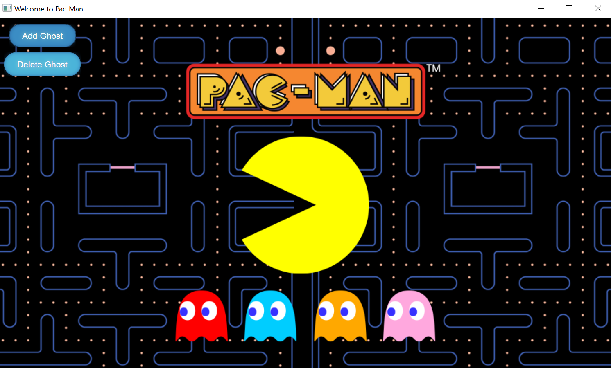
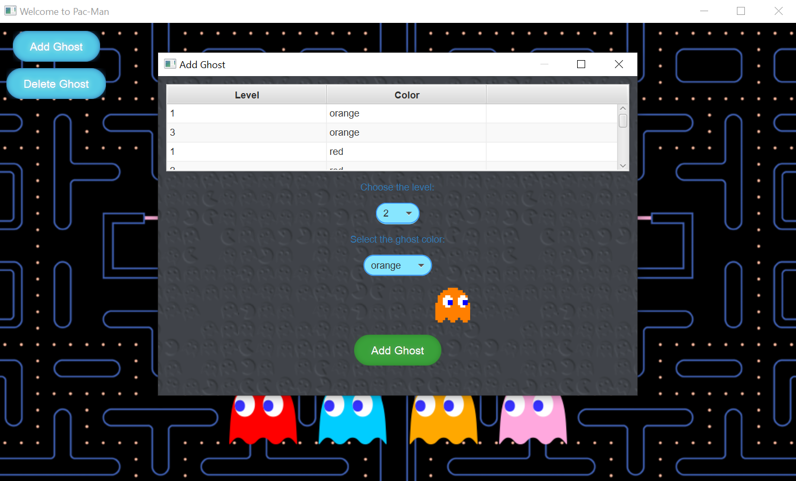
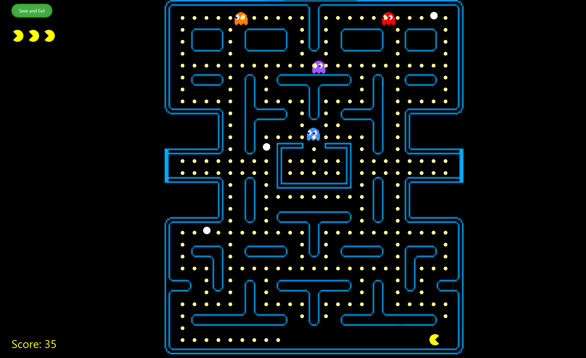
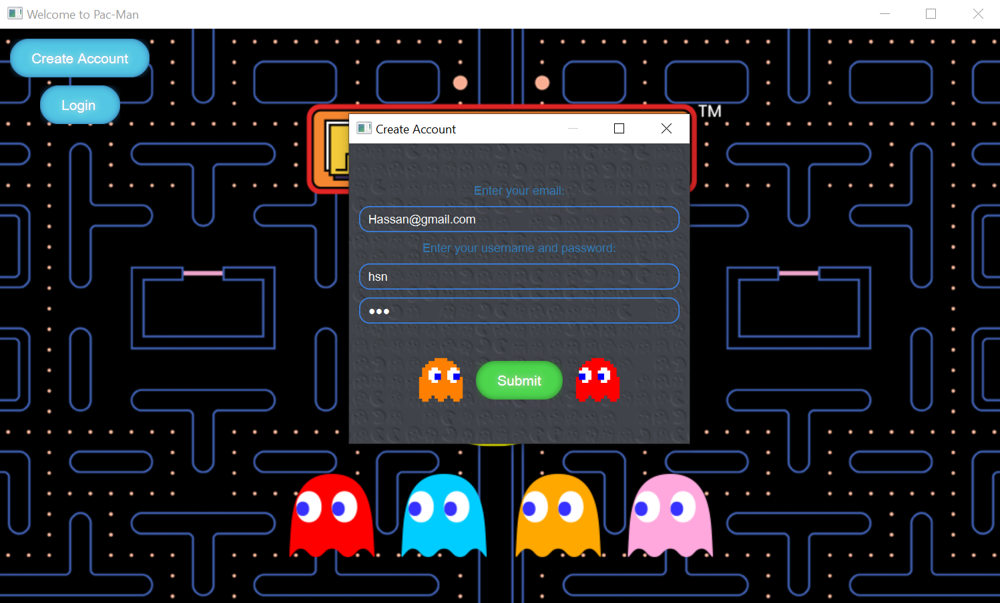
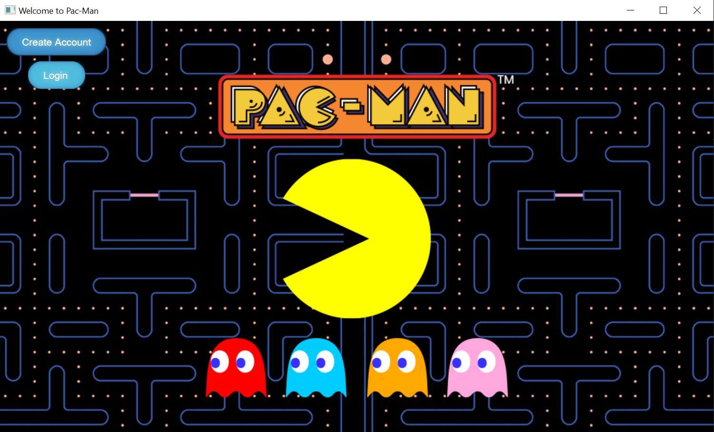
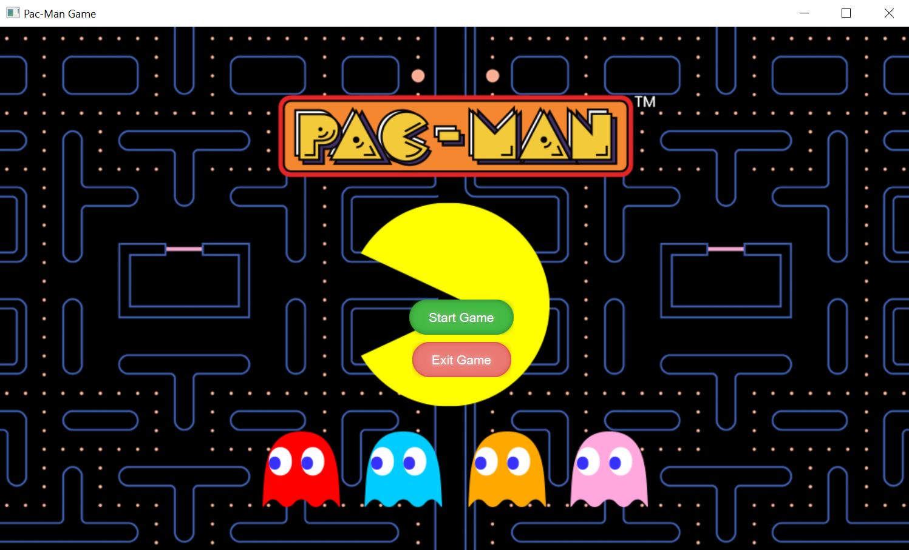

# JavaFX Game Project - Pac-Man

This JavaFX game project involves the successful development of a PAC-MAN game, applying Object-Oriented Programming (OOP) principles. The project utilizes JavaFX for dynamic and interactive visuals, providing an engaging gaming experience. BootstrapFX and custom CSS are employed to enhance the game's UI, incorporating responsive and visually captivating elements for a seamless and visually engaging environment within the PAC-MAN game.

## Table of Contents

- [Project Highlights](#project-highlights)
- [Project Classes](#project-classes)
- [Database Tables](#database-tables)
- [Technologies Used](#technologies-used)
- [Showcase](#showcase)

## Project Highlights

- **Game Development with JavaFX:**
  - Successfully developed a PAC-MAN game using JavaFX, leveraging OOP principles for efficient and structured code.

- **UI Enhancement with BootstrapFX and CSS:**
  - Utilized BootstrapFX and custom CSS to improve the game's UI, ensuring a responsive and visually captivating user interface.

- **Database Management with SQL Workbench:**
  - Proficiently utilized SQL Workbench to manage game statistics and user profiles.
  - Designed an efficient database schema and executed optimized queries for seamless data storage and retrieval.

- **Security Implementation:**
  - Integrated SHA-256 encryption for password security, ensuring the protection of sensitive game data and user credentials within the application.

- **Admin Interface Development:**
  - Developed an admin interface allowing administrators to manage game levels.
  - Admins can add or remove ghosts, choose ghost colors, and perform other level-related tasks.

- **Team Collaboration:**
  - Collaborated effectively within a team, leading the team through brainstorming, planning, and efficient development phases.
  - Ensured timely delivery for the PAC-MAN game project.

## Project Classes

1. **Pacman:**
   - Class representing the PAC-MAN character.

2. **Ghost:**
   - Class representing the ghost characters within the game.

3. **Level:**
   - Class managing the different levels in the game.

4. **Game:**
   - Class overseeing the overall game mechanics and flow.

5. **Player:**
   - Class representing the player and handling player-related functionalities.

6. **DB:**
   - Database class responsible for handling database functions.

7. **Application:**
   - JavaFX Application class for running the PAC-MAN game.

## Database Tables

1. **Player:**
   - Table storing player information.

2. **Level:**
   - Table managing different levels in the game.

3. **Ghost:**
   - Table storing information about ghost characters.

4. **Game:**
   - Table managing overall game data.

5. **Ghost_Level:**
   - Junction table assigning ghosts to levels.

## Technologies Used

- JavaFX
- Java
- BootstrapFX
- CSS
- SQL
- Database Design Concepts

## Showcase

### Admin Interface

### Game Interface

### Home and Start Screens

---

[**Return to Top**](#table-of-contents)
